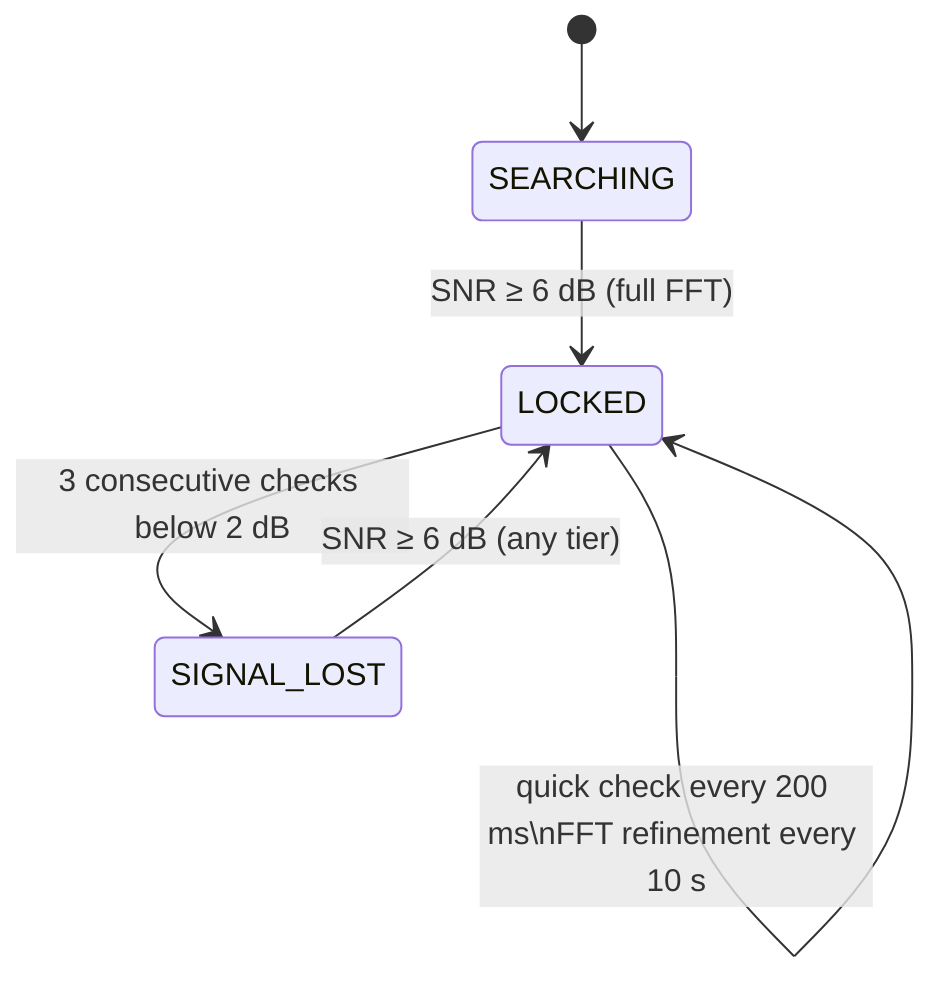

# ContinuousAnalyzer

`ContinuousAnalyzer` runs on a daemon thread and continuously estimates signal
strength and noise floor for any 120 pps powerline arc signal present in the
audio stream. Results are published to a lock-protected slot that the UI polls
at display time. The core design is a three-state machine: SEARCHING, LOCKED,
and SIGNAL_LOST.

---

## How signal and noise are measured

Powerline arcing at 60 Hz produces RF impulses at 120 pps. At 16 kHz that's
one pulse every 133.333... samples. Signal and noise levels are both measured
by summing audio amplitude at expected pulse-phase positions across an analysis
window and dividing — mean absolute amplitude over those sample positions. The
choice of mean absolute amplitude rather than RMS reflects the impulsive nature
of arcing: the arc fires near the AC voltage peak and is quiet the rest of the
time, so RMS would spread the burst energy across the full cycle and understate
the interference amplitude by a large factor.

The signal phase is whichever sample offset within the 133.333-sample period
gives the highest correlation with the 120 pps pulse pattern. The noise phase
is whichever offset gave the *lowest* correlation — the quietest window in the
period, which ideally represents the receiver noise floor with no powerline
component mixed in.

Finding phases initially uses FFT cross-correlation against a pulse-train
kernel. The kernel must be a palindrome so that `fftconvolve` (convolution)
gives the same result as cross-correlation; this requires placing kernel
coefficients at `int(i × spp)` positions. Amplitude averaging at those stored
phases uses `round(i × spp)` instead — this halves the maximum per-pulse
positional error from ⅔ to ⅓ of a sample and removes the systematic bias
toward the early side of each pulse. The two rounding schemes coexist because
the palindrome property only holds with truncation.

---

## State machine

### SEARCHING

No phase information has been established yet. Every second the analyzer runs
a full FFT cross-correlation over 1 second of audio, locates the peak and
minimum of the fit array, and checks whether the SNR at those phases clears
6 dB. Until it does, a noise-only result is published. When it does, the peak
and noise phases are stored, a `_phases_valid` flag is set, and the machine
moves to LOCKED. It never returns to SEARCHING.

### LOCKED

We know where the signal is. Every 200 ms `_quick_check()` measures the
amplitude at both stored phases using a direct Numba amplitude average — fast
enough to run continuously without noticeable CPU load. SNR is allowed to drop
below 2 dB for up to three consecutive checks before declaring signal loss.
A single noisy frame doesn't cause a state change; three consecutive failures
are required.

Every 10 seconds `_phase_search()` runs to correct for slow mains frequency
drift, scanning ±10 samples around each stored phase. A full FFT isn't needed
here: any drift fast enough to exceed the search radius would already cause
`_quick_check()` to fail first, dropping to SIGNAL_LOST where the full FFT
runs anyway via Tier 3b.

**Lock is acquired at SNR ≥ 6 dB and lost after three checks below 2 dB.**
The hysteresis gap between those thresholds prevents a signal right at the
margin from flipping back and forth.

### SIGNAL_LOST

The stored phases from the last lock are still valid. Re-acquisition runs in
tiers, cheapest first.

**Tier 1 — every 200 ms: `_noise_check()`**

Sample both stored phases. If SNR ≥ 6 dB, re-lock immediately and publish. If
not, publish a noise-only result with the noise floor sampled live at the stored
noise phase. The noise floor stays current during signal loss rather than
holding whatever it was when we last locked.

**Tier 2 — every 1 s: `_phase_search()`**

Scan ±10 samples around `_peak_phase` for the highest amplitude, and scan ±10
samples around `_noise_phase` *independently* for the lowest amplitude. These
two scans are kept separate because the signal phase and the quiet inter-pulse
window don't necessarily drift together. With multiple arcing sources on the
power line, the quiet window is wherever none of them happen to land — it can
move at a completely different rate from any one source's phase, or disappear
and reappear elsewhere if a source fires up near the old quiet window. Shifting
`_noise_phase` by the same delta as `_peak_phase` would be the wrong move in
that environment. If the best signal candidate clears 6 dB SNR against the
best independently-found noise floor, both phases are updated and we re-lock.

**Tier 3a — every 5 s: `_fast_scan()`**

Run an FFT cross-correlation with a short kernel: 15 pulses instead of 60,
against 0.25 s of audio instead of 1 s. The shorter input keeps the FFT at
~8192 points rather than ~32768, making this roughly 6× cheaper than the full
analysis. If the ratio of peak fit score to minimum fit score clears 4 dB,
something is probably there and Tier 3b runs to confirm. If nothing shows up —
which is the typical case when the environment is genuinely quiet — we skip the
expensive FFT entirely. This is the main point of the two-stage design.

**Tier 3b — on a Tier 3a hit, or every 120 s unconditionally: `_full_analysis()`**

The full 1-second, 60-pulse FFT analysis, identical to what SEARCHING runs.
Refreshes both phases from the FFT argmax and argmin when it locks. The
120-second unconditional fallback ensures a fresh full FFT eventually happens
even if Tier 3a's threshold is too conservative to fire on a weak signal.

---

## Constants reference

| Constant | Value | Meaning |
|---|---|---|
| `LOCK_ACQUIRE_SNR` | 6.0 dB | Minimum SNR to enter LOCKED |
| `LOCK_LOSE_SNR` | 2.0 dB | SNR below which a failure is counted |
| `LOSE_LOCK_COUNT` | 3 | Consecutive failures before SIGNAL_LOST |
| `LOCKED_INTERVAL` | 0.2 s | Quick-check cadence in LOCKED and SIGNAL_LOST |
| `REFINE_INTERVAL` | 10 s | Full FFT phase refinement while LOCKED |
| `SEARCH_INTERVAL` | 1 s | Phase search cadence in SIGNAL_LOST |
| `PHASE_SEARCH_RADIUS` | 10 samples | Scan radius for Tier 2 in each direction |
| `FAST_SCAN_INTERVAL` | 5 s | Tier 3a cadence in SIGNAL_LOST |
| `FAST_SCAN_PULSES` | 15 | Pulses in the short Tier 3a kernel |
| `FAST_SCAN_SAMPLES` | 4000 | Audio window for Tier 3a (~0.25 s at 16 kHz) |
| `FAST_SCAN_SNR` | 4 dB | Tier 3a hit threshold; triggers Tier 3b |
| `SIGNAL_LOST_REFINE` | 120 s | Unconditional Tier 3b in SIGNAL_LOST |
