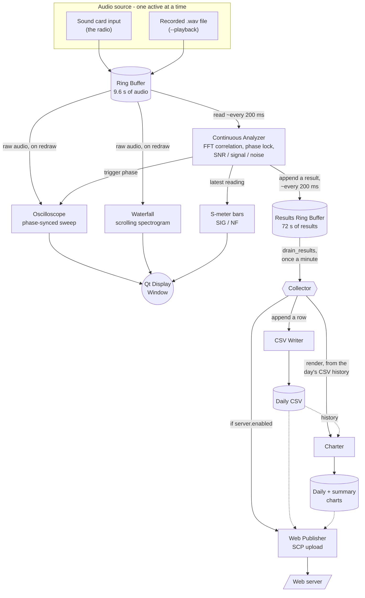

# How it works

## Block Diagram

(some assistance obtained from Agentic AI in producing the diagram)

## Operation fundamentals

### Audio Capture

In the case of sound card operation, the Python `sounddevice` module activates a callback whenever a block of audio sample data is available.  This data is then migrated into the audio ring buffer.  In the case of a .wav file source (i.e., with the `--playback` command line option), the wav file is read and its samples are chunked and fed into the ring buffer at a clocked rate.

Whenever data has been added to the ring buffer, a `threading.Condition` notifies other interested parties that audio is available for consumption.

### Analysis

The analyzer runs constantly on a variable-length cycle, a loop that runs forever with a variable length wait between cycles, depending on the state of things.

The analysis itself runs through three states: FREE, LOCK, and HOLD (internally SEARCHING, LOCKED, and SIGNAL_LOST).

In "FREE" mode, once per second, a full cross-correlation (by way of FFT convolution) of a 120pps pulse train is run against incoming audio, looking for any match significant enough to analyze.  Once a positive match has been found, the analyzer switches to the LOCK state.

In the LOCK state, the duration of the cycle is reduced to 200ms and full cross correlations are no longer performed.  Instead, every 600ms a brief search is performed before and after the current position in time where the impulse train is believed to hold its maximal value to see if the greatest peak has shifted earlier or later in time (indicating a phase shift from the predicted position).  If a significantly better match is found, the position is corrected, and the extent of the correction is saved.  This allows the drift from precisely 60 Hz (or 50 Hz) to be predicted and for that prediction to be refined over time.

Should the lock be lost (meaning, the SNR between the signal and the estimated noise floor drops below a threshold), things briefly enter the SIGNAL_LOST state.  Here it first attempts to immediately re-acquire the signal using the last known good phase information.  If that fails, every second the same phase search from the LOCK state is attempted, looking before and after the predicted impulse noise position in time for a signal.  Additionally, every 5 seconds a "fast" cross-correlation is run using far fewer points in the correlation pattern in an effort to locate a signal while minimizing CPU overhead, and with a less stringent requirement for success.  If the fast scan finds a promising signal, then a full cross-correlation is run, otherwise it's skipped.  Upon successful re-acquisition of the signal, things can return to the LOCK state.

After 60 seconds in the HOLD (SIGNAL_LOST) state, things return to the "FREE" (SEARCHING) state.

The analyzer frequently publishes analysis results which contain the estimated noise floor and estimated impulse noise signal strength.  These data are observed by the S meter in the main display, and consumed by the Collector.  The estimated utility frequency in Hz, made possible by the frequent phase measurements, is not part of these published results - it's read directly from the analyzer, by the status bar in the main display and by the Collector when it writes a CSV row.

### Waterfall, Scope, S-Meter Display

The main display is implemented in Qt and contains three main elements: the traditional spectrum waterfall, a phosphor-emulating, phase-locked simulated oscilloscope display, and a pair of S meters for noise floor and impulse noise strength.

The waterfall and scope displays both refresh using a QTimer every 100ms (10 fps).  The S meter display also uses a QTimer but set to 200ms (because the analyzer is on a 200ms cycle at its fastest, there's no point in updating the S meters any faster than once every 200ms).

The waterfall simply reads audio from the same audio ring buffer as the analyzer and uses FFT to display a spectrum waterfall.  In the presence of strong repeating impulse noise, considerable harmonics are produced, and this results in the familiar "herringbone" pattern in the waterfall.

The scope display also receives phase information from the analyzer so that it can make small adjustments to the positioning in the time domain in an effort to try to keep waveforms landing in the same spot on the display over time.  This also means the phase calculations and corrections only need to be performed once, in the analyzer, and the scope display simply becomes a consumer of this data.

Similarly, the S meters are consumers of analysis data from the analyzer and update to show the most recent noise floor and signal strengths as calculated by the analyzer.

### Collector

The collector is simple: it wakes up once per minute, drains all of the analyzer's data for the last minute, derives averages for the signal strength and noise floor, notes whether a signal lock was found for none, some, or all of the last minute, optionally downloads weather data for correlation, and then orchestrates writing this data out to CSV, producing graphs and charts, and optionally uploading it to a web server.

### Other

Recording and video rendering are not covered here in detail, but these are actually a lot more straightforward than they sound.

Much like the main display, the recorder is a consumer of both the audio pipeline and the analysis pipeline, and it simply records the audio pipeline to .wav files in response to data points retrieved from the analyzer (along with its own configured rules).

Video rendering simply takes advantage of built-in capabilities of Qt itself to render frames in a pipeline to ffmpeg, which handles the actual assembly of the video recordings.
