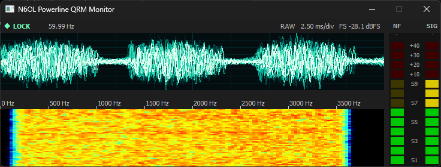
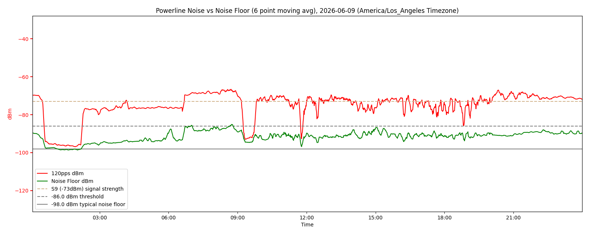
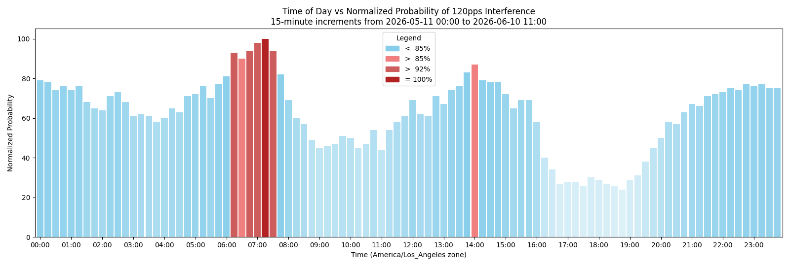

# Getting started

## Install Python

The N6OL Powerline QRM Monitor requires Python, version 3.12 or later.  How you install this will vary depending on your operating system.  You can find tips and suggestions at [python.org](https://python.org/).  Just make sure you have at least version 3.12 on your system and in your system path before proceeding.

You can test to make sure Python is installed and working by running `python --version` from the command line, or to check a specific version, you can try `python3.14 --version`, `python3 --version`, etc.

If you just installed Python and your current command window was open prior to installation, you probably need to close and re-open your command window for Python to be found on your system path.

## Download the monitor

Find the latest release at [https://github.com/spatula75/n6ol-powerline-qrm-monitor/releases](https://https://github.com/spatula75/n6ol-powerline-qrm-monitor/releases), scroll to the end of the release description and look under "Assets."  Here you will find a `.tar.gz` and `.zip` file; download whichever one is appropriate for your platform.  Linux and FreeBSD users likely want the tarball, whereas MacOS and Windows users likely want the zip archive.

The monitor does not (yet) install itself as a fullly integrated piece of software on any operating system, so just find a suitable directory on your system, and extract the files.  For example:

```
mkdir ham_radio
cd ham_radio
tar xzvf ../n6ol-powerline-qrm-monitor-1.5.0.tar.gz 
```

```
mkdir ham_radio
cd ham_radio
unzip ../n6ol-powerline-qrm-monitor-1.5.0.zip
```

On Windows and MacOS you can also just create a folder somewhere, such as off your home directory, drag the archive file into that directory, and then expand the archive.

## Run Setup

The monitor ships with setup scripts for both Windows and Linux, FreeBSD, MacOS, etc.  These scripts are called `setup.bat` and `setup.sh`.  From the command line, run whichever is appropriate to your environment.  On *nix variants, you likely need to precede this with `./`, i.e., `./setup.sh` to indicate to your shell that it should look in the current folder.

Setup will attempt to locate your Python installation, create a virtual environment (aka a "venv"), install the project's dependencies, and then it will run the configuration program for the first time.

If you've run setup before, it will skip directly to launching the configuration program - it's safe to run it more than once.

## Configuration

The monitor has many options. The most critical ones will be covered here; others can be found in the how-to guides.

At this point, you should connect your radio to your sound device that you plan to use for monitoring and verify that your operating system recognizes sound coming from your radio as input.

Set your RF gain to 0, disable pre-amps, attenuators, widen your filter bandwidth all the way, turn off AGC, and switch to either LSB or USB mode.  Adjust the gain in your operating system for minimal interference with the signal, ideally 0dB gain and no "enhancements" applied.  IN Windows, disable "exclusive access" to the device, and you can right-click the input gain to choose measurement in decibels to find 0dB.

Each section of the configuration file corresponds to a section in the configuration program.  Enter a section with the `ENTER` key and go back with the `ESC` key.  Use arrow keys to navigate.  Start with Audio.

### Audio Configuration

Start by picking your audio device, the first option on the screen.  When you select this option, all the devices on your system will be polled to see if they support the required sample rate, and the current amplitude seen on the device will be sampled.  This amplitude is displayed to the left of the selection in a bar graph.  So if you're not sure which device is the one you're using, you can look for the one that seems to be seeing sound.  If you're still not sure, try turning the volume up or down and press "R" to re-scan to see which bar graph is changing.

Choose the appropriate device, and press `ENTER` to select it.

At the bottom of this menu is the `Calibration` tool.  Much more detail can be found in the Calibration tutorial, but for now, try turning the AF gain up and down on your radio until the S meter in the display of the configuration program matches the S meter on your radio.  If your radio doesn't have an AF gain you can adjust for its line output, you can also vary the gain for your audio input in your operating system.  The goal is to get the value inferred from the audio stream to match the RF value displayed by your radio's S meter.

If you are unable to get the two to agree because you can't adjust the audio gain at all, there's another method available; see the [Calibration tutorial](calibration.md) for more.

To get the pulse rate setting, double your local electrical utility's alternating current frequency.  For the most of North and Central America, for example, that means 120.  For Europe and Asia, this is usually 100.  Chances are if you're using this tool, you're already very familiar with the frequency you need.

### Station Configuration

Here is where you'll set your call sign, time zone, CSV, chart, and recording output base directory.  Time zones are given in IANA city-name format; choose the closest city to you from the list that follows the same time zone rules as you.  Daylight Saving Time is applied automatically, and the current offset from UTC is displayed alongside each zone.  For the United States, the most common time zones to choose are `America/New_York`, `America/Chicago`, `America/Denver`, `America/Los_Angeles`, `Pacific/Honolulu`, and `America/Anchorage`, though there are others as well, for example for cities that do not observe DST.

For "Summary graph start date" enter today's date in ISO format (sorry, this will improve at some point).  For example, `2026-08-07T12:34:00-0700`.  It won't hurt anything if you don't set this, but it determines the earliest date on which the summary chart will look for historical CSV files, and it will check every day from this day until the present day (again, sorry, I promise to make this better!).

### Weather Configuration

Sometimes there are interesting correlations to be had between the weather and whether your electrical utility's equipment is making noise.  Currently two systems are supported for retrieving weather data for your location: OpenMeteo and CumulusMX.  If you have your own weather station supported by CumulusMX, you can point to it here.  Getting the URL format for Cumulus is important; make sure it looks like this: `http://cumulusmx.local:8998/api/tags/process.json?temp&hum&SolarRad&wspeed&wgust&avgbearing` replacing `cumulusmx.local` with the IP address or hostname of the machine running CumulusMX.

For OpenMeteo, enter your location's latitute and longitude, and the closest weather station to your location will be used to retrieve weather data.

### Others

That's all the configuration you really need to start collecting data.  If you want to [publish your results to a web host](../how-to-guides/server-publishing.md), [record events](../how-to-guides/recording-events.md), or [render events to video](../how-to-guides/replaying-recordings.md), see the how-to guides for each of these topics.

## Launching

To launch with the default arguments, just execute `run.bat` or `./run.sh` from the monitor directory.  If you wish to run with an alternate set of options, see the [CLI reference](../reference/cli.md).

The monitor will launch with its small display window and begin tracking utility company noise.

## The Main Window



The main graphical display shows a status bar with the current operational status (`FREE`, `LOCK`, or `HOLD`), the estimated utility power frequency when in `LOCK` or `HOLD` modes, whether the scope is in Raw or Average mode, the span of time per division of the scope, and the full scale of the scope in dB (the scope auto-scales to fit).

Below this is a fairly typical waterfall not unlike what you've seen in every digital demodulating program.

To the right are two bar-graph style meters.  The NF meter shows the estimated Noise Floor in dBm, and when in LOCK mode, the SIG meter shows the estimated strength of the 120 or 100 pps SIGnal, also in dBm.  (In actuality these are estimations based on peak and minimum impulses across the time domain.)

## CSV Logging

Once per minute, on the minute, the average noise floor and average signal strength is logged to a CSV file whose filename is formatted with the current date, along with an indication of whether a signal lock was found for the full minute, part of the minute, or none of the minute.  The CSV row also contains the most recent weather data at the time the estimate was taken.

CSV files roll over automatically at the end of the day in the local time zone.

Nothing deletes old CSV files at present.

## Charts

Various charts are also produced at the time the CSV files are updated.  Every minute the two main plots are updated - one instantaneous, and one with a 6-point rolling average.  Once per hour, the summary graphs are also generated showing the relative probability of observing noise charted against the current time of day.

Nothing deletes old charts at present.




